# TriStar Homes - UD Blockchain ND Capstone Project

In this project you will be minting your own tokens to represent your title to the properties. Before you mint a token, you need to verify you own the property. You will use zk-SNARKs to create a verification system which can prove you have title to the property without revealing that specific information on the property. We covered the basics on zk-SNARKs in Privacy.

Once the token has been verified you will place it on a blockchain market place (OpenSea) for others to purchase.

OpenSea is a decentralized marketplace that is used for selling for crypto assets such as CryptoKitties and other digital assets that are powered off Ethereum. On OpenSea, you can buy or sell any of these items through a smart contract, meaning that no central authority ever holds custody of your items.


### Project Dependencies Version

```shell
$truffle version
	Truffle v5.1.61 (core: 5.1.61)
	Solidity - 0.5.2 (solc-js)
	Node v14.12.0
	Web3.js v1.2.9
```


### Running Test Cases

1. Open Terminal in root directory of project
2. Run `npm i` to install all dependencies
3. Execute `cd eth-contracts/`
4. Execute `truffle develop` to run development truffle cli blockchain
5. Open another terminnal in root directory of project
6. Execute `cd eth-contracts/`
7. Execute `truffle test` to run all test cases present in `eth-contracts/test` folder.

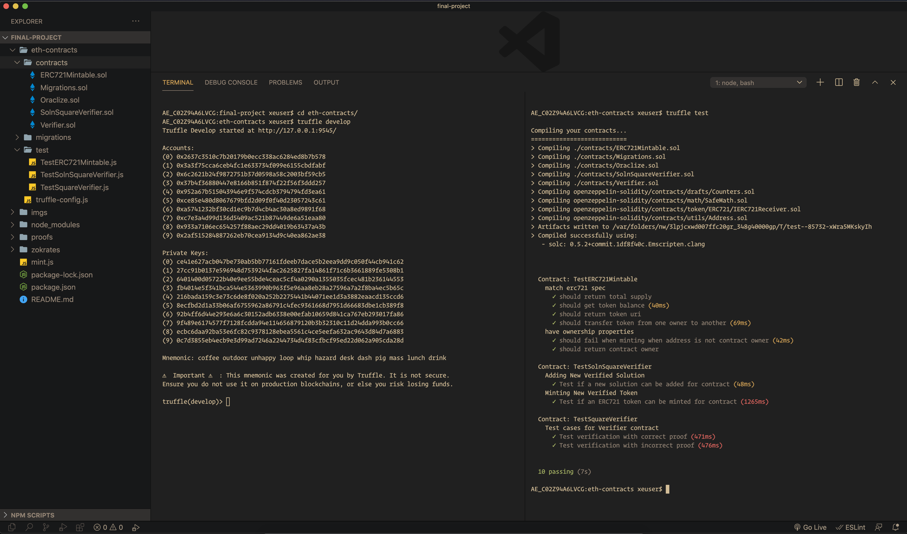

```shell
$ truffle test

Compiling your contracts...
===========================
> Compiling ./contracts/ERC721Mintable.sol
> Compiling ./contracts/Migrations.sol
> Compiling ./contracts/Oraclize.sol
> Compiling ./contracts/SolnSquareVerifier.sol
> Compiling ./contracts/Verifier.sol
> Compiling openzeppelin-solidity/contracts/drafts/Counters.sol
> Compiling openzeppelin-solidity/contracts/math/SafeMath.sol
> Compiling openzeppelin-solidity/contracts/token/ERC721/IERC721Receiver.sol
> Compiling openzeppelin-solidity/contracts/utils/Address.sol
> Artifacts written to /var/folders/nw/3lpjcxwd007ffc20gr_348g40000gp/T/test--85732-xWra5MKskyIh
> Compiled successfully using:
   - solc: 0.5.2+commit.1df8f40c.Emscripten.clang


  Contract: TestERC721Mintable
    match erc721 spec
      ✓ should return total supply
      ✓ should get token balance (40ms)
      ✓ should return token uri
      ✓ should transfer token from one owner to another (69ms)
    have ownership properties
      ✓ should fail when minting when address is not contract owner (42ms)
      ✓ should return contract owner

  Contract: TestSolnSquareVerifier
    Adding New Verified Solution
      ✓ Test if a new solution can be added for contract (48ms)
    Minting New Verified Token
      ✓ Test if an ERC721 token can be minted for contract (1265ms)

  Contract: TestSquareVerifier
    Test cases for Verifier contract
      ✓ Test verification with correct proof (471ms)
      ✓ Test verification with incorrect proof (476ms)


  10 passing (7s)
```

### Main Contract ABI - SolnSquareVerifier

(To get ABI for other contracts, please run `truffle compile` in `eth-contracts` folder and find it in `eth-contracts/build/contracts` folder respectively.)

```json
{
"abi": [
    {
      "constant": true,
      "inputs": [
        {
          "name": "interfaceId",
          "type": "bytes4"
        }
      ],
      "name": "supportsInterface",
      "outputs": [
        {
          "name": "",
          "type": "bool"
        }
      ],
      "payable": false,
      "stateMutability": "view",
      "type": "function"
    },
    {
      "constant": true,
      "inputs": [
        {
          "name": "tokenId",
          "type": "uint256"
        }
      ],
      "name": "getApproved",
      "outputs": [
        {
          "name": "",
          "type": "address"
        }
      ],
      "payable": false,
      "stateMutability": "view",
      "type": "function"
    },
    {
      "constant": false,
      "inputs": [
        {
          "name": "to",
          "type": "address"
        },
        {
          "name": "tokenId",
          "type": "uint256"
        }
      ],
      "name": "approve",
      "outputs": [],
      "payable": false,
      "stateMutability": "nonpayable",
      "type": "function"
    },
    {
      "constant": true,
      "inputs": [],
      "name": "getSymbol",
      "outputs": [
        {
          "name": "",
          "type": "string"
        }
      ],
      "payable": false,
      "stateMutability": "view",
      "type": "function"
    },
    {
      "constant": true,
      "inputs": [],
      "name": "getName",
      "outputs": [
        {
          "name": "",
          "type": "string"
        }
      ],
      "payable": false,
      "stateMutability": "view",
      "type": "function"
    },
    {
      "constant": true,
      "inputs": [],
      "name": "totalSupply",
      "outputs": [
        {
          "name": "",
          "type": "uint256"
        }
      ],
      "payable": false,
      "stateMutability": "view",
      "type": "function"
    },
    {
      "constant": false,
      "inputs": [
        {
          "name": "from",
          "type": "address"
        },
        {
          "name": "to",
          "type": "address"
        },
        {
          "name": "tokenId",
          "type": "uint256"
        }
      ],
      "name": "transferFrom",
      "outputs": [],
      "payable": false,
      "stateMutability": "nonpayable",
      "type": "function"
    },
    {
      "constant": true,
      "inputs": [
        {
          "name": "_myid",
          "type": "bytes32"
        },
        {
          "name": "_result",
          "type": "string"
        }
      ],
      "name": "__callback",
      "outputs": [],
      "payable": false,
      "stateMutability": "pure",
      "type": "function"
    },
    {
      "constant": true,
      "inputs": [
        {
          "name": "owner",
          "type": "address"
        },
        {
          "name": "index",
          "type": "uint256"
        }
      ],
      "name": "tokenOfOwnerByIndex",
      "outputs": [
        {
          "name": "",
          "type": "uint256"
        }
      ],
      "payable": false,
      "stateMutability": "view",
      "type": "function"
    },
    {
      "constant": true,
      "inputs": [
        {
          "name": "_myid",
          "type": "bytes32"
        },
        {
          "name": "_result",
          "type": "string"
        },
        {
          "name": "_proof",
          "type": "bytes"
        }
      ],
      "name": "__callback",
      "outputs": [],
      "payable": false,
      "stateMutability": "pure",
      "type": "function"
    },
    {
      "constant": false,
      "inputs": [
        {
          "name": "to",
          "type": "address"
        },
        {
          "name": "tokenId",
          "type": "uint256"
        }
      ],
      "name": "mint",
      "outputs": [
        {
          "name": "isMinted",
          "type": "bool"
        }
      ],
      "payable": false,
      "stateMutability": "nonpayable",
      "type": "function"
    },
    {
      "constant": false,
      "inputs": [
        {
          "name": "from",
          "type": "address"
        },
        {
          "name": "to",
          "type": "address"
        },
        {
          "name": "tokenId",
          "type": "uint256"
        }
      ],
      "name": "safeTransferFrom",
      "outputs": [],
      "payable": false,
      "stateMutability": "nonpayable",
      "type": "function"
    },
    {
      "constant": false,
      "inputs": [],
      "name": "pauseContract",
      "outputs": [],
      "payable": false,
      "stateMutability": "nonpayable",
      "type": "function"
    },
    {
      "constant": true,
      "inputs": [
        {
          "name": "index",
          "type": "uint256"
        }
      ],
      "name": "tokenByIndex",
      "outputs": [
        {
          "name": "",
          "type": "uint256"
        }
      ],
      "payable": false,
      "stateMutability": "view",
      "type": "function"
    },
    {
      "constant": true,
      "inputs": [
        {
          "name": "tokenId",
          "type": "uint256"
        }
      ],
      "name": "ownerOf",
      "outputs": [
        {
          "name": "",
          "type": "address"
        }
      ],
      "payable": false,
      "stateMutability": "view",
      "type": "function"
    },
    {
      "constant": true,
      "inputs": [
        {
          "name": "owner",
          "type": "address"
        }
      ],
      "name": "balanceOf",
      "outputs": [
        {
          "name": "",
          "type": "uint256"
        }
      ],
      "payable": false,
      "stateMutability": "view",
      "type": "function"
    },
    {
      "constant": true,
      "inputs": [],
      "name": "getOwner",
      "outputs": [
        {
          "name": "",
          "type": "address"
        }
      ],
      "payable": false,
      "stateMutability": "view",
      "type": "function"
    },
    {
      "constant": false,
      "inputs": [
        {
          "name": "to",
          "type": "address"
        },
        {
          "name": "approved",
          "type": "bool"
        }
      ],
      "name": "setApprovalForAll",
      "outputs": [],
      "payable": false,
      "stateMutability": "nonpayable",
      "type": "function"
    },
    {
      "constant": false,
      "inputs": [
        {
          "name": "from",
          "type": "address"
        },
        {
          "name": "to",
          "type": "address"
        },
        {
          "name": "tokenId",
          "type": "uint256"
        },
        {
          "name": "_data",
          "type": "bytes"
        }
      ],
      "name": "safeTransferFrom",
      "outputs": [],
      "payable": false,
      "stateMutability": "nonpayable",
      "type": "function"
    },
    {
      "constant": false,
      "inputs": [],
      "name": "unPauseContract",
      "outputs": [],
      "payable": false,
      "stateMutability": "nonpayable",
      "type": "function"
    },
    {
      "constant": true,
      "inputs": [],
      "name": "getBaseTokenURI",
      "outputs": [
        {
          "name": "",
          "type": "string"
        }
      ],
      "payable": false,
      "stateMutability": "view",
      "type": "function"
    },
    {
      "constant": true,
      "inputs": [
        {
          "name": "tokenId",
          "type": "uint256"
        }
      ],
      "name": "tokenURI",
      "outputs": [
        {
          "name": "",
          "type": "string"
        }
      ],
      "payable": false,
      "stateMutability": "view",
      "type": "function"
    },
    {
      "constant": true,
      "inputs": [
        {
          "name": "owner",
          "type": "address"
        },
        {
          "name": "operator",
          "type": "address"
        }
      ],
      "name": "isApprovedForAll",
      "outputs": [
        {
          "name": "",
          "type": "bool"
        }
      ],
      "payable": false,
      "stateMutability": "view",
      "type": "function"
    },
    {
      "constant": false,
      "inputs": [
        {
          "name": "newOwner",
          "type": "address"
        }
      ],
      "name": "transferOwnership",
      "outputs": [],
      "payable": false,
      "stateMutability": "nonpayable",
      "type": "function"
    },
    {
      "inputs": [
        {
          "name": "solVerifier",
          "type": "address"
        },
        {
          "name": "_name",
          "type": "string"
        },
        {
          "name": "_symbol",
          "type": "string"
        },
        {
          "name": "_baseTokenURI",
          "type": "string"
        }
      ],
      "payable": false,
      "stateMutability": "nonpayable",
      "type": "constructor"
    },
    {
      "anonymous": false,
      "inputs": [
        {
          "indexed": false,
          "name": "index",
          "type": "uint256"
        },
        {
          "indexed": false,
          "name": "solVerifiedUser",
          "type": "address"
        },
        {
          "indexed": false,
          "name": "hashKey",
          "type": "bytes32"
        }
      ],
      "name": "NewSolutionAdded",
      "type": "event"
    },
    {
      "anonymous": false,
      "inputs": [
        {
          "indexed": true,
          "name": "from",
          "type": "address"
        },
        {
          "indexed": true,
          "name": "to",
          "type": "address"
        },
        {
          "indexed": true,
          "name": "tokenId",
          "type": "uint256"
        }
      ],
      "name": "Transfer",
      "type": "event"
    },
    {
      "anonymous": false,
      "inputs": [
        {
          "indexed": true,
          "name": "owner",
          "type": "address"
        },
        {
          "indexed": true,
          "name": "approved",
          "type": "address"
        },
        {
          "indexed": true,
          "name": "tokenId",
          "type": "uint256"
        }
      ],
      "name": "Approval",
      "type": "event"
    },
    {
      "anonymous": false,
      "inputs": [
        {
          "indexed": true,
          "name": "owner",
          "type": "address"
        },
        {
          "indexed": true,
          "name": "operator",
          "type": "address"
        },
        {
          "indexed": false,
          "name": "approved",
          "type": "bool"
        }
      ],
      "name": "ApprovalForAll",
      "type": "event"
    },
    {
      "anonymous": false,
      "inputs": [
        {
          "indexed": false,
          "name": "contractOwner",
          "type": "address"
        }
      ],
      "name": "Paused",
      "type": "event"
    },
    {
      "anonymous": false,
      "inputs": [
        {
          "indexed": false,
          "name": "contractOwner",
          "type": "address"
        }
      ],
      "name": "UnPaused",
      "type": "event"
    },
    {
      "anonymous": false,
      "inputs": [
        {
          "indexed": false,
          "name": "oldOwner",
          "type": "address"
        },
        {
          "indexed": false,
          "name": "newOwner",
          "type": "address"
        }
      ],
      "name": "TransferedOwnership",
      "type": "event"
    },
    {
      "constant": false,
      "inputs": [
        {
          "name": "index",
          "type": "uint256"
        },
        {
          "name": "solVerifiedUser",
          "type": "address"
        },
        {
          "name": "hashKey",
          "type": "bytes32"
        }
      ],
      "name": "addNewSolution",
      "outputs": [],
      "payable": false,
      "stateMutability": "nonpayable",
      "type": "function"
    },
    {
      "constant": false,
      "inputs": [
        {
          "name": "solVerifiedUser",
          "type": "address"
        },
        {
          "name": "tokenId",
          "type": "uint256"
        },
        {
          "name": "a",
          "type": "uint256[2]"
        },
        {
          "name": "b",
          "type": "uint256[2][2]"
        },
        {
          "name": "c",
          "type": "uint256[2]"
        },
        {
          "name": "input",
          "type": "uint256[2]"
        }
      ],
      "name": "verifiedMint",
      "outputs": [
        {
          "name": "isMinted",
          "type": "bool"
        }
      ],
      "payable": false,
      "stateMutability": "nonpayable",
      "type": "function"
    }
  ],
}
```


### Zokrates Verifier.sol Generation

1. Start Docker Desktop
2. Execute following in terminal
```shell
cd /Users/xeuser/Desktop/blockchain_nanodegree/projects/final-project
docker run -v /Users/xeuser/Desktop/blockchain_nanodegree/projects/final-project/zokrates/code:/home/zokrates/code -ti zokrates/zokrates /bin/bash
cd code/square 

which zokrates                      # To check if zokrates is defined in docker image container
zokrates compile -i square.code     # compile
zokrates compute-witness -a 8 64    # Here we usually use a root and its square
zokrates generate-proof             # generate a proof of computation
zokrates export-verifier            # export a solidity verifier
```


### Multiple Proofs Generation

1. Start Docker Desktop
2. Execute following in terminal
```shell
cd /Users/xeuser/Desktop/blockchain_nanodegree/projects/final-project
docker run -v /Users/xeuser/Desktop/blockchain_nanodegree/projects/final-project/zokrates/code:/home/zokrates/code -ti zokrates/zokrates /bin/bash
cd code/square

zokrates compile -i square.code     # compile
zokrates compute-witness -a 1 1     # Here we usually use a root and its square
zokrates generate-proof             # generate a proof of computation

zokrates compute-witness -a 2 4     # Here we usually use a root and its square
zokrates generate-proof             # generate a proof of computation

zokrates compute-witness -a 3 9     # Here we usually use a root and its square
zokrates generate-proof             # generate a proof of computation

zokrates compute-witness -a 4 16    # Here we usually use a root and its square
zokrates generate-proof             # generate a proof of computation

zokrates compute-witness -a 5 25    # Here we usually use a root and its square
zokrates generate-proof             # generate a proof of computation

zokrates compute-witness -a 6 36    # Here we usually use a root and its square
zokrates generate-proof             # generate a proof of computation

zokrates compute-witness -a 7 49    # Here we usually use a root and its square
zokrates generate-proof             # generate a proof of computation

zokrates compute-witness -a 8 64    # Here we usually use a root and its square
zokrates generate-proof             # generate a proof of computation

zokrates compute-witness -a 9 81    # Here we usually use a root and its square
zokrates generate-proof             # generate a proof of computation

zokrates compute-witness -a 10 100  # Here we usually use a root and its square
zokrates generate-proof             # generate a proof of computation
```
> After each `generate-proof` move proof.json to proofs folder and rename it as per iteration.

Above can alo be done by shell scripting but to keep things at primary level for clear understanding, rather a manual approach was chosen.


### Project Deployment on Rinkeby

```shell
$ truffle migrate --reset --network rinkeby

Compiling your contracts...
===========================
> Compiling ./contracts/ERC721Mintable.sol
> Compiling ./contracts/Migrations.sol
> Compiling ./contracts/Oraclize.sol
> Compiling ./contracts/SolnSquareVerifier.sol
> Compiling ./contracts/Verifier.sol
> Compiling openzeppelin-solidity/contracts/drafts/Counters.sol
> Compiling openzeppelin-solidity/contracts/math/SafeMath.sol
> Compiling openzeppelin-solidity/contracts/token/ERC721/IERC721Receiver.sol
> Compiling openzeppelin-solidity/contracts/utils/Address.sol
> Artifacts written to /Users/xeuser/Desktop/blockchain_nanodegree/projects/final-project/eth-contracts/build/contracts
> Compiled successfully using:
   - solc: 0.5.2+commit.1df8f40c.Emscripten.clang


Starting migrations...
======================
> Network name:    'rinkeby'
> Network id:      4
> Block gas limit: 10000000 (0x989680)


1_initial_migration.js
======================

   Deploying 'Migrations'
   ----------------------
   > transaction hash:    0x3f49993ab4bc95a4ab7debc741c92cd52d1c3b48f29cb71fb79d4a0d6c4c47bc
   > Blocks: 2            Seconds: 17
   > contract address:    0x0498ddE2743f8562D1ae006180321A507D3348fC
   > block number:        8326363
   > block timestamp:     1617128949
   > account:             0xca2ceb85734dF92E8d78360d9658A81232Be4622
   > balance:             40.458653111
   > gas used:            236270 (0x39aee)
   > gas price:           20 gwei
   > value sent:          0 ETH
   > total cost:          0.0047254 ETH

   Pausing for 2 confirmations...
   ------------------------------
   > confirmation number: 1 (block: 8326364)
   > confirmation number: 2 (block: 8326365)

   > Saving migration to chain.
   > Saving artifacts
   -------------------------------------
   > Total cost:           0.0047254 ETH


2_deploy_contracts.js
=====================

   Deploying 'Verifier'
   --------------------
   > transaction hash:    0xf3dd1319678b0a3569fe919ad832b802a57e74cfb73eb4561e975603d5d9008b
   > Blocks: 1            Seconds: 9
   > contract address:    0xc2f59559F6F2055AE73EeA23a5A12AE846fA78e8
   > block number:        8326367
   > block timestamp:     1617129009
   > account:             0xca2ceb85734dF92E8d78360d9658A81232Be4622
   > balance:             40.437500191
   > gas used:            1011878 (0xf70a6)
   > gas price:           20 gwei
   > value sent:          0 ETH
   > total cost:          0.02023756 ETH

   Pausing for 2 confirmations...
   ------------------------------
   > confirmation number: 1 (block: 8326368)
   > confirmation number: 2 (block: 8326369)

   Deploying 'SolnSquareVerifier'
   ------------------------------
   > transaction hash:    0xee9b34b88ebb93a46a854f621118e44b746aa7e14c2dcb923591970ba44b3c24
   > Blocks: 1            Seconds: 9
   > contract address:    0xa535BE600BfD7401101b7377Fb994B583581fB14
   > block number:        8326370
   > block timestamp:     1617129054
   > account:             0xca2ceb85734dF92E8d78360d9658A81232Be4622
   > balance:             40.368270131
   > gas used:            3461503 (0x34d17f)
   > gas price:           20 gwei
   > value sent:          0 ETH
   > total cost:          0.06923006 ETH

   Pausing for 2 confirmations...
   ------------------------------
   > confirmation number: 1 (block: 8326371)
   > confirmation number: 2 (block: 8326372)

   > Saving migration to chain.
   > Saving artifacts
   -------------------------------------
   > Total cost:          0.08946762 ETH


Summary
=======
> Total deployments:   3
> Final cost:          0.09419302 ETH
```


### Rinkeby Contracts & Tokens

**Smart Contracts**

| Verifier Contract           | [0xc2f59559F6F2055AE73EeA23a5A12AE846fA78e8](https://rinkeby.etherscan.io/address/0xc2f59559F6F2055AE73EeA23a5A12AE846fA78e8) |
| --------------------------- | ------------------------------------------------------------ |
| SolnSquareVerifier Contract | [0xa535BE600BfD7401101b7377Fb994B583581fB14](https://rinkeby.etherscan.io/address/0xa535BE600BfD7401101b7377Fb994B583581fB14) |

**Minted Tokens**

```shell
$ node mint.js
Minted Token 0 Tx Hash : 0x5324077a5d752a819b2254f606a945f371880cdfe162d79aaaea2b73ec55d928
Minted Token 1 Tx Hash : 0xa0cf6d808f5c652364c562874500c5b5a3ba6a1b9219bbe3a46189602997d014
Minted Token 2 Tx Hash : 0x820ced866de759d493f78b977befb11c480711ca1528ff2de9441d28b1cf6ac5
Minted Token 3 Tx Hash : 0xf1e0c6ea3781806f517b81610aaa130dada92cdf28efe4140bf9aba7513977b0
Minted Token 4 Tx Hash : 0x236f7d9b853f6b2e73f80ea8ba33e45c3c17528a11fb65f22659b0e69fac79bb
Minted Token 5 Tx Hash : 0x792b72bd12c687e6a56fd4d4633e154aba81728a4f676cfa6c60d80fb9d67d64
Minted Token 6 Tx Hash : 0x1121649559a617168badc525b215a40233e359228fb46195bdf8b9f6da070b26
Minted Token 7 Tx Hash : 0xbc012491690f43b161244ea9ef1d094491280b18d570b513fb2baf03f23969cf
Minted Token 8 Tx Hash : 0xf1c59d51fd0eb1046a52eb190526cb0af862b17b482f631513c8cba40a74f3d1
Minted Token 9 Tx Hash : 0x3359baed8e93f2a516b7f17ff4cdd298b99a701aa48416867bcbdeafca508782
```

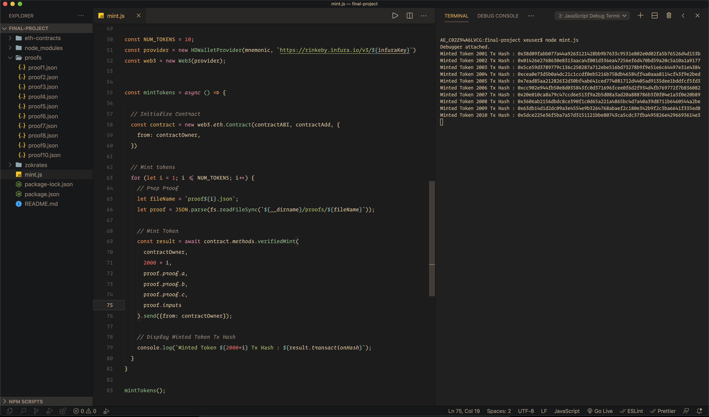

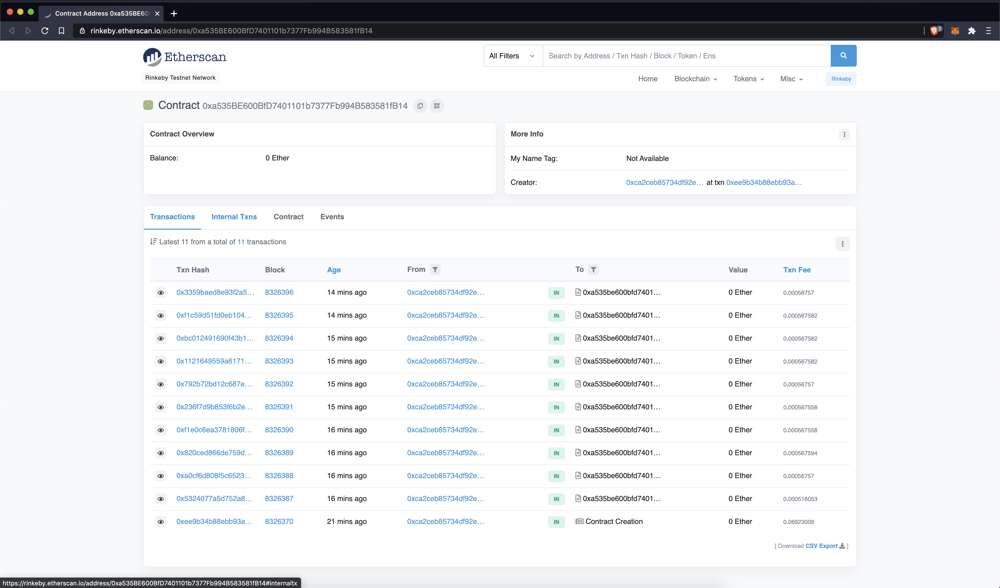


### OpenSea Market Place NFTs

1. https://testnets.opensea.io/assets/0xa535BE600BfD7401101b7377Fb994B583581fB14/0

   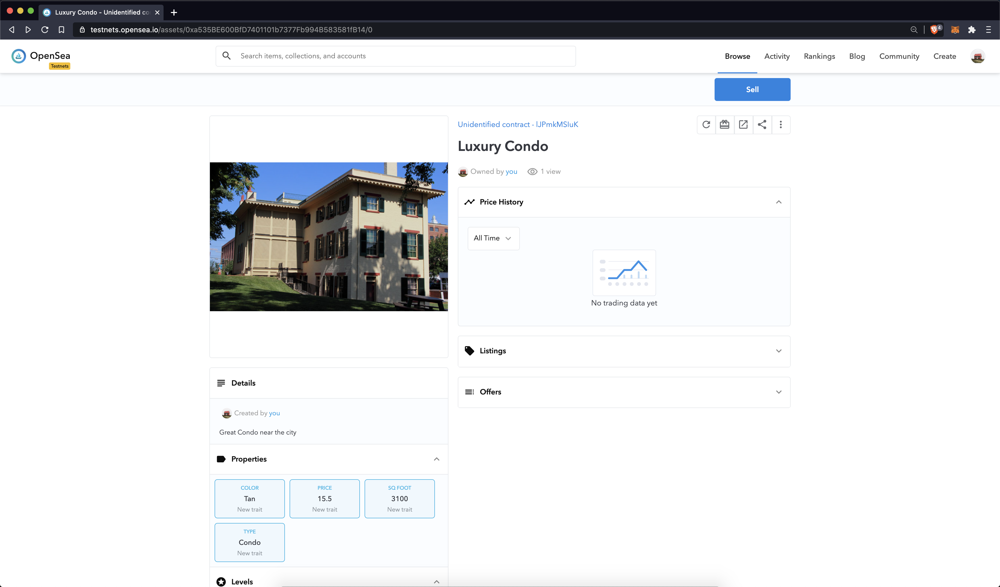


2. https://testnets.opensea.io/assets/0xa535BE600BfD7401101b7377Fb994B583581fB14/1
   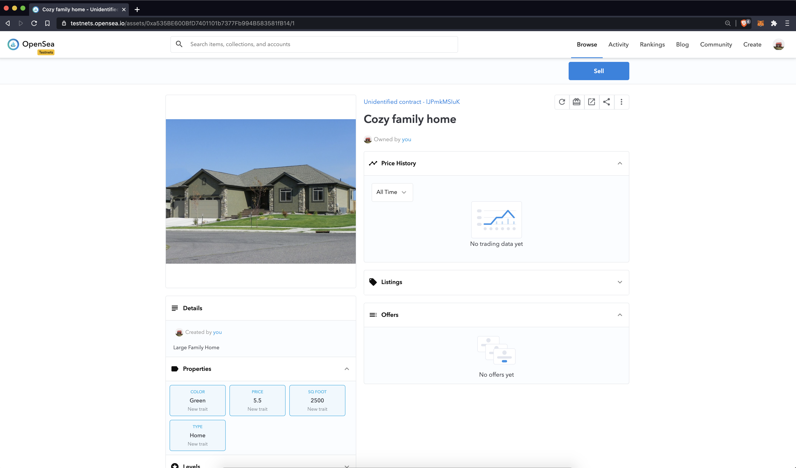

3. https://testnets.opensea.io/assets/0xa535BE600BfD7401101b7377Fb994B583581fB14/2
   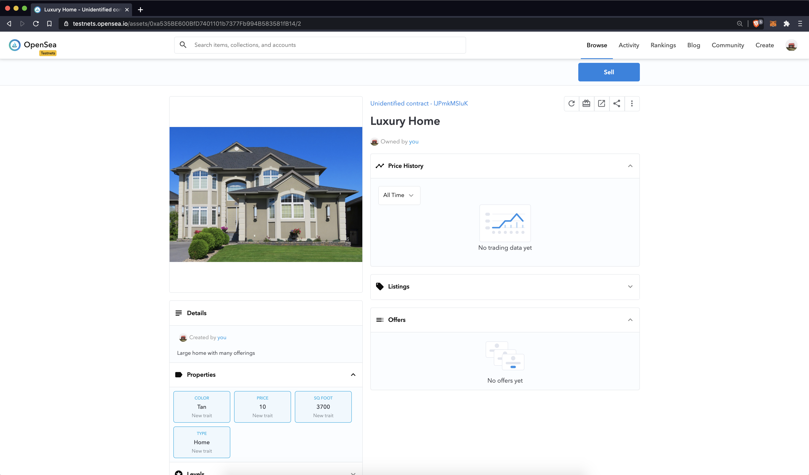

4. https://testnets.opensea.io/assets/0xa535BE600BfD7401101b7377Fb994B583581fB14/3
   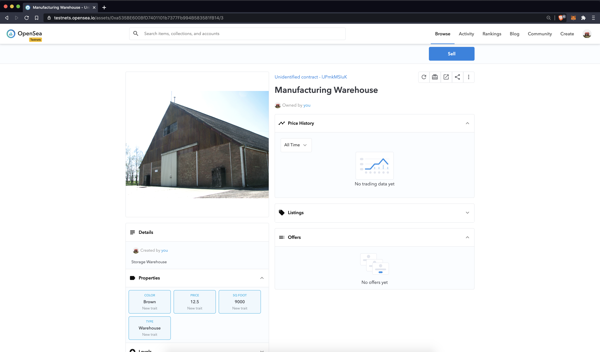

5. https://testnets.opensea.io/assets/0xa535BE600BfD7401101b7377Fb994B583581fB14/4
   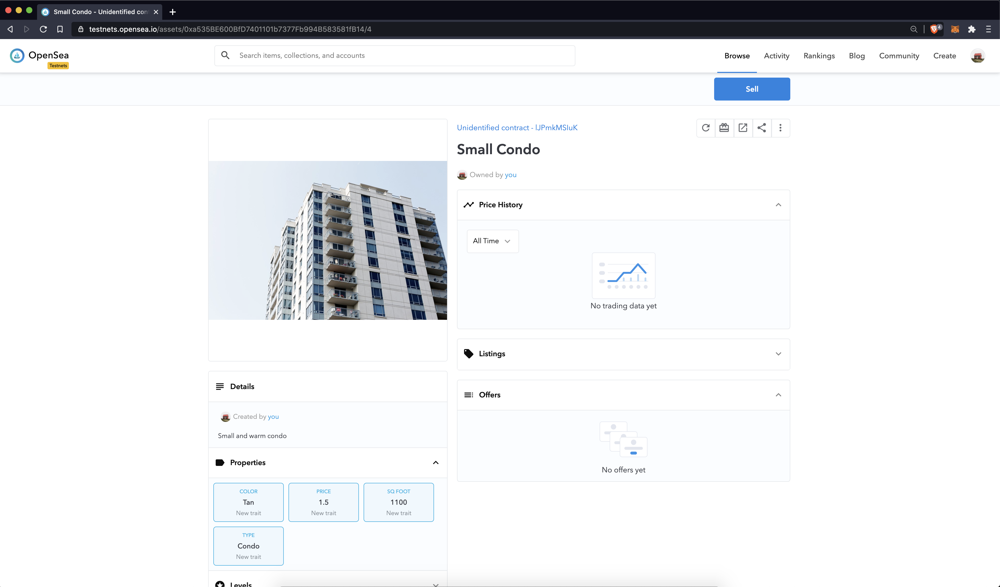


### Buying OpenSea NFT

1. tokenId0 - https://rinkeby.etherscan.io/tx/0xff6eb2c9324a594661f1888fac8363a33d9a780e1cf479c14932dd21132e4c31

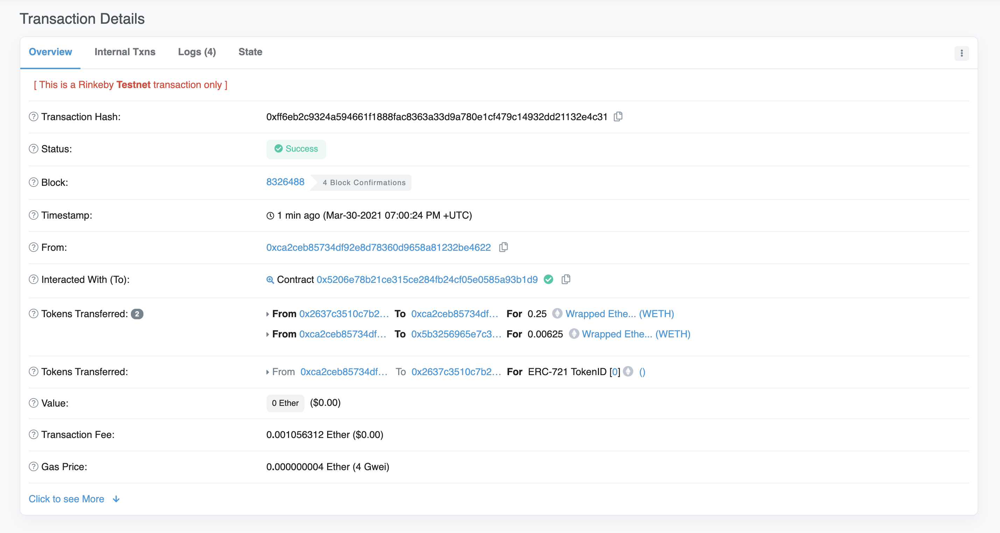

From

Owner [0xca2ceb85734dF92E8d78360d9658A81232Be4622] to Buyer [0x2637C3510C7b20179b0eCC338AC6284eD8b7b578]

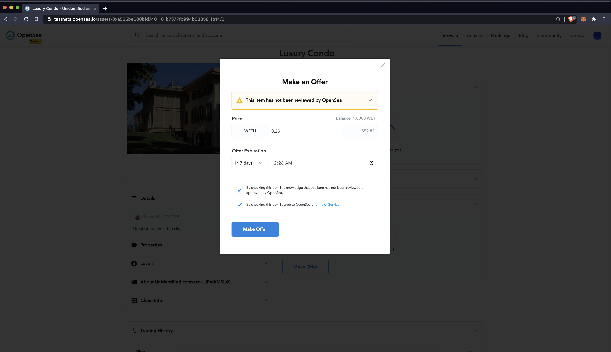

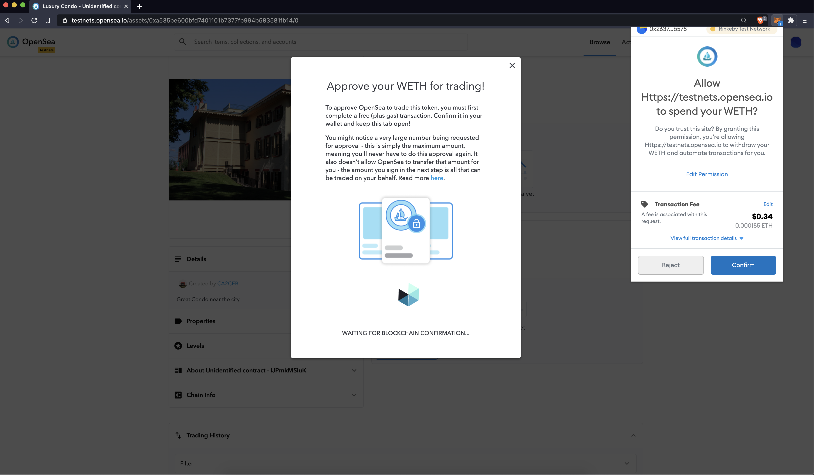

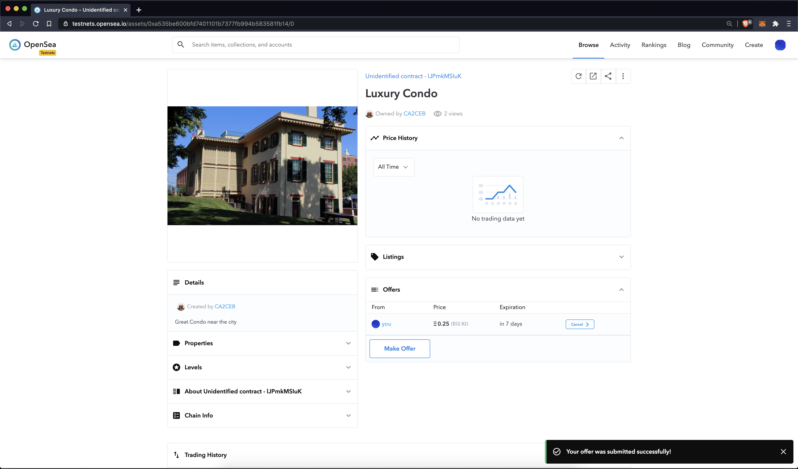

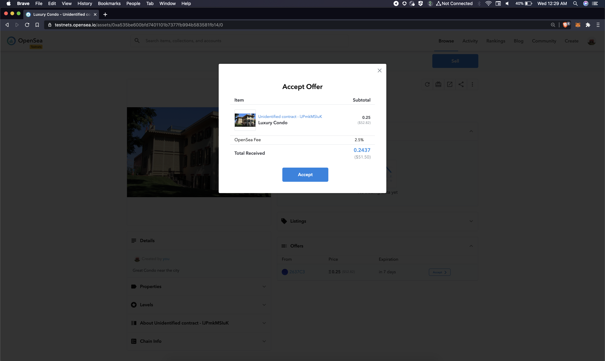

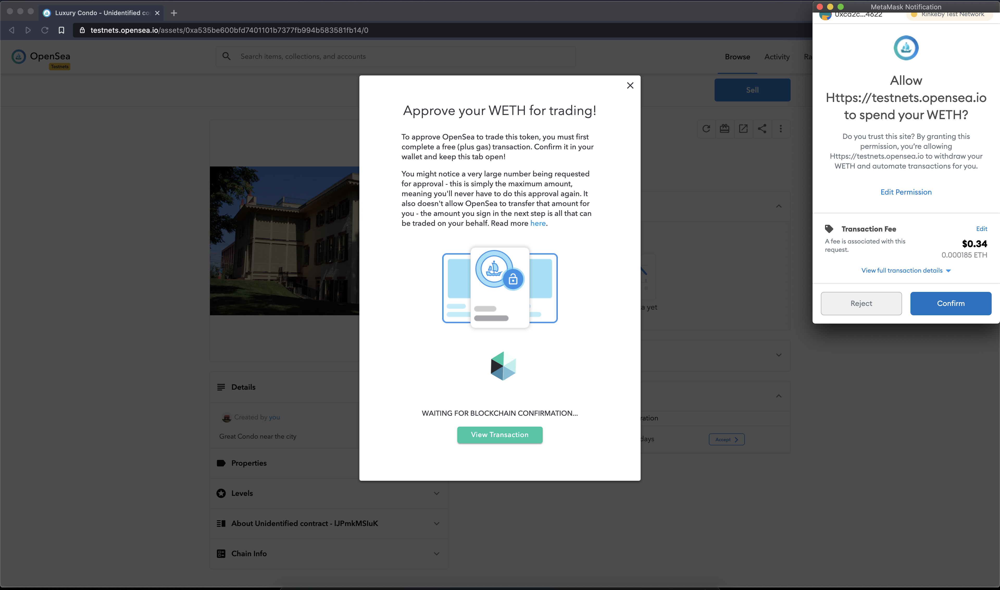

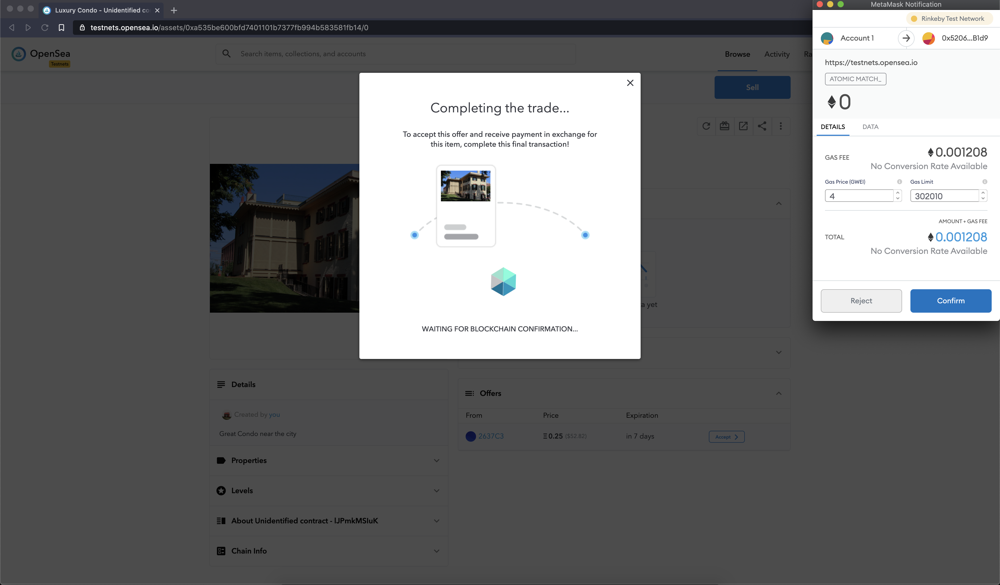

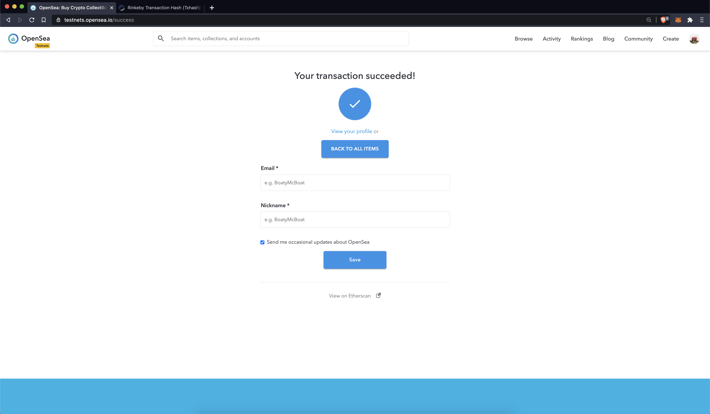

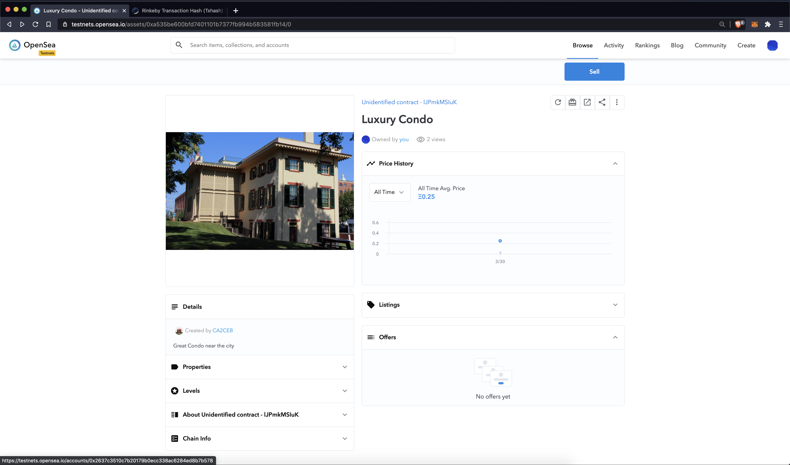


Remaining 4 NFTs Purchase Transactions are below:

2. tokenId1 - https://rinkeby.etherscan.io/tx/0x7454d9dc7cfbdeb10644e1843b4a243e9994567aa114c56f4ef5458fce70d9be
3. tokenId2 - https://rinkeby.etherscan.io/tx/0xf90e849975c36ef1cdf5a60d632f418f4c777b35fe72bea57dc45317b2c46771
4. tokenId3 - https://rinkeby.etherscan.io/tx/0x000dd5c47a34e8b4c7e71655c8db0e7fff806f5a9d8666de35428231de503038
5. tokenId4 - https://rinkeby.etherscan.io/tx/0x8e0c61377286812bbec88d80965d9bd046216d26b2ddfc927f4359747119450b


### Project Resources

* [UD Knowledge - Total Test Cases Required](https://knowledge.udacity.com/questions/55626)
* [UD Knowledge - Guide to writing TestSquareVerifier](https://knowledge.udacity.com/questions/146160)
* [UD Knowledge - Multiple Proofs Generation](https://knowledge.udacity.com/questions/369063)


